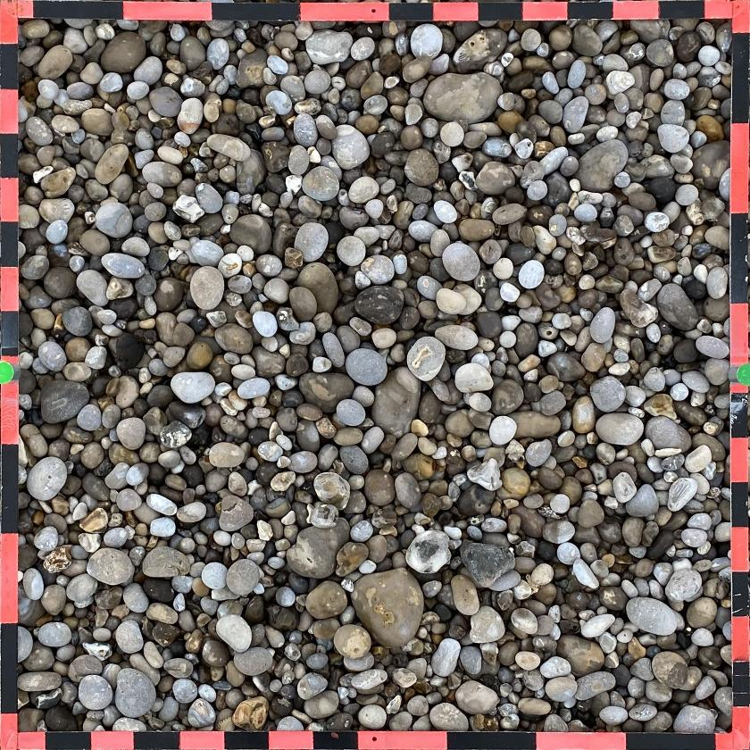
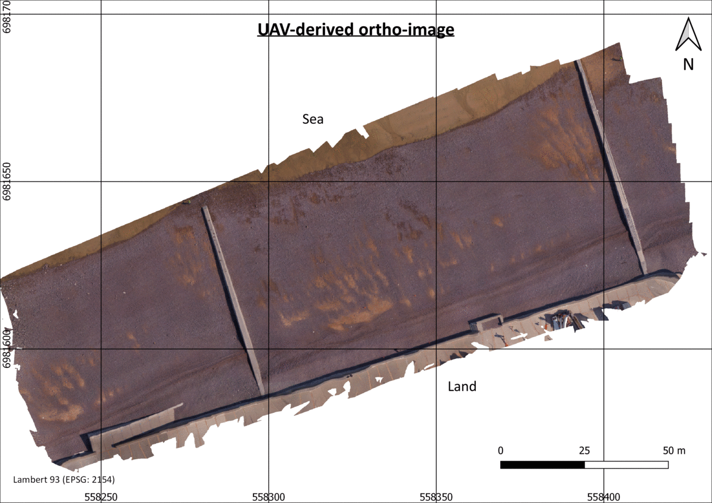

# Clast Size Measurement and Mapping using Mask R-CNN

## 1. Description
Clasts Segmentation, Measurement and Mapping (CSMM) is an algorithm that uses the Mask-RCNN model ([He et al., 2017](https://openaccess.thecvf.com/content_iccv_2017/html/He_Mask_R-CNN_ICCV_2017_paper.html)) in order to analyze grain size of coarse clasts, rounded by water, on images. First, the model performs the unsupervized identification and contouring of the non-overlapping elements visible on RGB and Grayscale images. Their dimensions are then measured along the axes of the ellipse that shows the best fit to every detected object (fig. 1). When applied on ortho-images, the present algorithm is able to map several statistical indices commonly used in grain size analysis (quantiles, average, density, standard deviation, skewness, and kurtosis) (fig. 2) of different parameters (ellipse major and minor axis, clast length, width, orientation and surface area, detection probability score).

*This code was written by Antoine Soloy and follows the methodology described in [Soloy et al. (2020)](https://www.mdpi.com/2072-4292/12/21/3659). It is based on the implementation of [Mask R-CNN by Matterport](https://github.com/matterport/Mask_RCNN)*


*Figure 1 - Step by step application of the methodology to terrestrial scaled photographs (1), using Mask R-CNN segmentation (2), followed by Ellipse fitting (3) and grain size distribution computed on the measurements along the ellipses' major axis (4)*

## 2. Requirements

This code relies on the initial implementation of [Mask R-CNN by Matterport](https://github.com/matterport/Mask_RCNN) on Windows 10 and was successfully tested on a computer with the following configuration: Intel® Core™ i7-8850H CPU 2.6GHz, 32GB RAM, NVIDIA Quadro P600 GPU.

## 3. Installation

The following installation instructions were adapted from [Matterport's github repository](https://github.com/matterport/Mask_RCNN). In case of any problem, please consider checking the original [installation process](https://github.com/matterport/Mask_RCNN#installation).

1. Download and install Anaconda from [the official website](https://www.anaconda.com/), using the version that is the most appropriate to your computer.
2. Open an anaconda prompt and install git:
   ```bash 
   conda install git
   ```
3. Clone this repository to the location you want:
   ```bash
   cd C:\your\path\goes\here
   git clone https://github.com/soloyant/clast-size-mapping
   ```
4. Create a new environment
   ```bash
   conda create env --name CSM python=3.6.9
   ```
5. Activate the new environment
   ```bash
   conda activate CSM
   ```
6. Install all the dependencies
   ```bash
   conda install pip3
   conda install requirements_conda.txt
   pip3 install requirements_pip.txt
   python setup.py install
   ```
7. Download and install [Visual C++ 2015 build tools](https://go.microsoft.com/fwlink/?LinkId=691126).
8. (Optionnal, for GPU use) Download and install cuda and cudnn from nvidia's website. This implementation was only tested with version 9 of cuda.
9. The installation should now be complete. Fill the [dedicated contact form](https://forms.gle/jpVWhQzEFuQvHuQE6) in order to receive a download link of the trained model weights.

## 4. Usage

In a command prompt, navigate to the repo's root and activate the Mask R-CNN environment, then open jupyter notebook, click on the file named "Clasts_Segmentation_Measurements_&_Mapping.ipynb" and follow the instructions.
```bash 
jupyter notebook
```
The algorithm essentially relies on the function called "clasts_detect()", which can be executed in two different modes depending on the type of data to be analyzed:
- Terrestrial images are scaled photographs with known resolution taken in bird eyes view perspective.
- UAV images refer to any large scale ortho-image in tif format including georeferencing meta-informations. The projection coordinates system is required to be projected, and the ground sampling distance (i.e. resolution) must be high enough. 
For each type, example files are provided in the "dataset" folder.

 
*Figure 2 - Examples of input images: (top) A terrestrial ortho-rectified image from bird eye perspective with a known resolution, (bottom) A geotiff ortho-image that is the result of the Surface From Motion (SFM) post-processing of the photographs taken during a UAV flight*

Each mode provides a table of individual clast characteristics (position, dimensions, detection score). In addition, the terrestrial mode is able to return and save figures of the masks and ellipses drawn on top of the original image, and a histogram of the measured sizes (fig. 1).
A post-processing rasterization can be achieved on the UAV-derived detected clasts using the function "clasts_rasterize()" in order to easily map different statistical factors and make it possible to analyze their spatial distribution (fig. 3)


*Figure 3 - Example of rasterized results of quantiles (Q05, Q16, Q50, Q84, Q95), average, standard deviation and object density applied on an ortho-image of the beach of Hautot-sur-Mer, France*

## 5. Publication of results
Please ensure proper citation of the authors in the case of publication of results provided by the application of this methodology.

*Soloy, A.; Turki, I.; Fournier, M.; Costa, S.; Peuziat, B.; Lecoq, N. A Deep Learning-Based Method for Quantifying and Mapping the Grain Size on Pebble Beaches. Remote Sens. 2020, 12, 3659, DOI: 10.3390/rs12213659.*